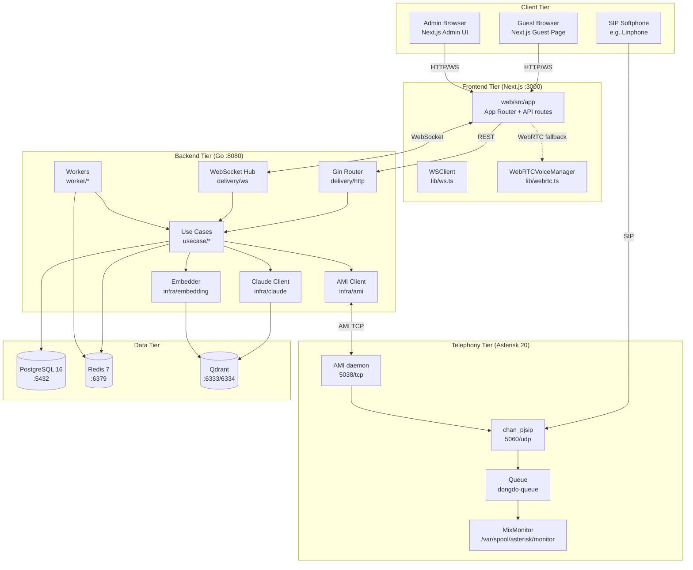
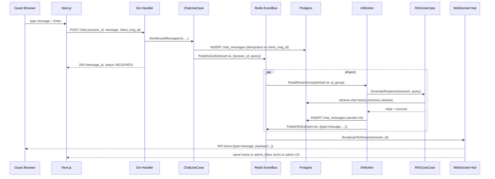
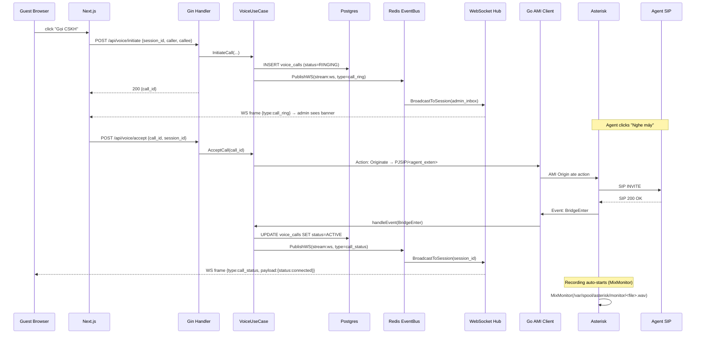
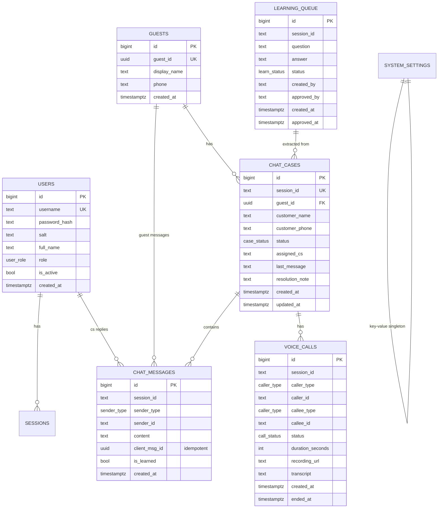

# Kiến trúc hệ thống (System Architecture)

> **Phiên bản:** v2.0
> **Đối tượng:** Backend devs, Frontend devs, DevOps engineers, Tech leads
> **Cập nhật lần cuối:** Sep 2026

## Mục lục

1. [Tổng quan các layer](#1-tổng-quan-các-layer)
2. [Sơ đồ tổng thể](#2-sơ-đồ-tổng-thể)
3. [Frontend (Next.js)](#3-frontend-nextjs)
4. [Backend (Go)](#4-backend-go)
5. [Telephony (Asterisk 20)](#5-telephony-asterisk-20)
6. [Data layer (Postgres + Redis)](#6-data-layer-postgres--redis)
7. [Data flow end-to-end](#7-data-flow-end-to-end)
8. [Database schema overview](#8-database-schema-overview)
9. [Redis Streams](#9-redis-streams)
10. [Worker responsibilities](#10-worker-responsibilities)
11. [Sequence diagrams](#11-sequence-diagrams)
12. [Scaling considerations](#12-scaling-considerations)
13. [Cross-references](#13-cross-references)

---

## 1. Tổng quan các layer

Hệ thống tuân theo **4 logical layers** tách biệt rõ ràng:

| Layer | Công nghệ | Trách nhiệm |
|---|---|---|
| **Presentation** | Next.js 14 (App Router) | Guest chat UI, Admin Inbox, Voice control, Analytics dashboard |
| **Application** | Go 1.21+ (Gin) | REST API, WebSocket hub, AMI client, business logic |
| **Telephony** | Asterisk 20 (PJSIP) | SIP signaling, RTP media, queue, recording, CDR |
| **Data** | PostgreSQL 16 + Redis 7 + Qdrant | Source of truth, event bus, vector search |

Mỗi layer giao tiếp qua interface rõ ràng:

- **Presentation ↔ Application**: REST (JSON) + WebSocket (JSON frames)
- **Application ↔ Telephony**: AMI (TCP port 5038, line-based text protocol)
- **Application ↔ Data**: SQL (pgxpool) + Redis protocol (go-redis v9)

---

## 2. Sơ đồ tổng thể



---

## 3. Frontend (Next.js)

### 3.1 Cấu trúc

```text
web/src/
├── app/
│   ├── page.tsx              # Guest chat page
│   ├── admin/                # Admin dashboard (login, inbox, calls, ...)
│   └── api/                  # Next.js API routes (proxy nếu cần)
├── components/
│   ├── guest/                # Guest widgets
│   ├── admin/                # Admin widgets (Sidebar, Inbox, ...)
│   └── forms/                # Form components
├── features/                 # Feature modules (auth, calls, inbox, ...)
├── lib/
│   ├── api/                  # Typed API client (axios-based)
│   ├── ws.ts                 # WSClient singleton
│   ├── webrtc.ts             # WebRTCVoiceManager (fallback)
│   └── stores/               # Zustand stores
└── hooks/                    # React Query wrappers
```

### 3.2 Routing

| Route | Component | Auth |
|---|---|---|
| `/` | `GuestChatPage` | Guest (no token) |
| `/login` | `LoginPage` | Public |
| `/admin/login` | `AdminLoginPage` | Public |
| `/admin/dashboard` | `Dashboard` | CSKH+ |
| `/admin/inbox` | `Inbox` | CSKH+ |
| `/admin/calls` | `CallsHistory` | CSKH+ |
| `/admin/customers` | `Customers` | CSKH+ |
| `/admin/learning` | `LearningQueue` | Admin+ |
| `/admin/knowledge` | `Knowledge` | Admin+ |
| `/admin/config` | `Config` | Admin+ |
| `/admin/analytics` | `Analytics` | CSKH+ |
| `/admin/permissions` | `Permissions` | Admin+ |

### 3.3 WebSocket client

`web/src/lib/ws.ts` cung cấp class `WSClient` với:

- Auto-reconnect với exponential backoff (`max=15s`, `attempts=10`)
- Heartbeat ping mỗi **25s** (server-side timeout: `WS_PING_INTERVAL` env)
- Typed event handlers (`on('message', fn)`, `on('call_ring', fn)`, ...)
- Wildcard handler: `on('*', fn)` cho debug/logging

URL pattern: `ws://<host>:8080/ws?session_id=...&user_id=...&role=...`

---

## 4. Backend (Go)

### 4.1 Clean Architecture

```text
cmd/server/main.go
  ├─ config.Load()                     ← env loader
  ├─ postgres.NewDB()                  ← pool + migrations + seed
  ├─ redis.NewClient() / EventBus      ← event bus + state
  ├─ qdrant.NewClient()                ← vector store
  ├─ embedding.NewEmbedder()           ← embedder
  ├─ claude.NewClient()                ← LLM
  ├─ usecase.NewXxxUseCase(...)        ← business logic
  ├─ delivery/http.SetupRouter()       ← routes
  ├─ delivery/ws.NewHub()              ← WS hub
  └─ worker.NewXxxWorker().Start()     ← background workers
```

### 4.2 Use cases (`internal/usecase/`)

| Use case | Responsibility |
|---|---|
| `AuthUseCase` | Login, logout, register guest, session mgmt |
| `ChatUseCase` | Send guest message, send CS reply, fetch history |
| `CaseUseCase` | Live inbox: list/take/resolve/delete cases, customer mgmt |
| `RAGUseCase` | Retrieve context from Qdrant + generate reply via Claude |
| `VoiceUseCase` | Initiate/accept/end/missed call (AMI-mediated) |
| `LearningUseCase` | Pending queue, approve/reject, voice-derived Q&A |
| `AnalyticsUseCase` | Dashboard stats, system config |
| `PartnerUseCase` | Templates, audit logs, system errors |

### 4.3 Domain entities (`internal/domain/entities.go`)

Các entity chính:

- `User`, `Session` — auth
- `Guest`, `Message` — chat
- `ChatCase`, `LearningItem`, `SystemErrorRecord` — case & learning
- `VoiceCall` — phone call records (RINGING/ACTIVE/ENDED/MISSED)
- `WSEvent`, `StreamMessage` — realtime events

### 4.4 Delivery layer

**`internal/delivery/http/router.go`** đăng ký ~50 routes, chia 4 nhóm:

1. **Public** — `POST /guest/register`, `POST /chat`, `GET /history/:id`, `POST /auth/login`
2. **WebSocket** — `GET /ws`
3. **Voice (public)** — `POST /api/voice/initiate`, `POST /api/voice/end`, `POST /api/voice/decline`, `POST /api/voice/upload-recording`, `GET /api/voice/status/:id`
4. **Admin (Bearer token)** — `GET/POST/PUT/DELETE /api/admin/*` với RBAC middleware

Middleware chain:

```text
RecoveryLog → RequestLog → GinLogger → CORS
  └─ /api/* (except public) → AuthMiddleware → RequireRoles(...)
```

---

## 5. Telephony (Asterisk 20)

Xem chi tiết [docs/TELEPHONY.md](./TELEPHONY.md). Tóm tắt:

| Layer | Config | Vai trò |
|---|---|---|
| **PJSIP signaling** | `docker/asterisk/etc/asterisk/pjsip.conf` | SIP endpoints: agent (1001-1010), guest browser, ARI, trunk-pstn |
| **Dialplan** | `extensions.conf` | Routing rules per context (`from-pstn`, `from-internal`, `from-guest`, `stasis`) |
| **Queues** | `queues.conf` | `dongdo-queue` (5 agents ringall), `dongdo-supervisor`, `dongdo-sales` |
| **AMI** | `manager.conf` | User `dongdo` (full), `monitor` (read-only) |
| **ARI** | `ari.conf` | REST + WebSocket stasis app `dongdo-ivr` |
| **Recording** | `*1` feature + MixMonitor | One-touch recording, auto-on for inbound queue |

---

## 6. Data layer (Postgres + Redis)

### 6.1 PostgreSQL

- **Source of truth.** Tất cả messages, cases, calls đều persist ở đây.
- **Connection pool** (`internal/repository/postgres/db.go`):
  - `MaxConns=25`, `MinConns=5`
  - `MaxConnLifetime=1h`, `MaxConnIdleTime=30m`
  - `HealthCheckPeriod=1m`
- **Migrations:** Goose v3, embedded qua `//go:embed migrations/`, tự chạy khi server start
- **Generated SQL:** SQLC từ `db/queries/<domain>/*.sql` → `internal/repository/sqlcdb/<domain>/`

### 6.2 Redis

- **Streams** (`stream:ws`, `stream:ai`, `stream:db`, `stream:dlq`) cho event bus
- **State** (TTL keys) — unread counter, typing indicator, AI execution flag
- **Distributed lock** (optional) — cho migration / leader election

Xem [§9 Redis Streams](#9-redis-streams).

### 6.3 Qdrant

- **Vector DB** cho RAG — embedding 384-dim từ `sentence-transformers/all-MiniLM-L6-v2`
- Cosine similarity search với metadata filtering (theo `source` filename)
- **Continuous learning**: CSKH duyệt Q&A mới → upsert vào collection

---

## 7. Data flow end-to-end

### 7.1 Guest gửi tin nhắn (chat path)



### 7.2 Guest gọi thoại (Asterisk path)



---

## 8. Database schema overview



### 8.1 Enums

```sql
CREATE TYPE user_role     AS ENUM ('owner', 'admin', 'leader', 'cskh', 'customer');
CREATE TYPE sender_type   AS ENUM ('guest', 'ai', 'human_cs', 'system');
CREATE TYPE case_status   AS ENUM ('AI_ACTIVE', 'NEEDS_HUMAN_CS', 'HUMAN_CS_ACTIVE', 'RESOLVED');
CREATE TYPE learn_status  AS ENUM ('PENDING', 'APPROVED', 'REJECTED');
CREATE TYPE call_status   AS ENUM ('RINGING', 'ACTIVE', 'ENDED', 'MISSED', 'REJECTED');
CREATE TYPE caller_type   AS ENUM ('guest', 'cskh');
```

---

## 9. Redis Streams

Cấu hình trong `internal/infra/redis/streams.go`:

| Stream | Consumer Group | Worker | Mục đích |
|---|---|---|---|
| `stream:ws` | `ws_group` | `ws_worker_*` | Realtime events tới WebSocket clients |
| `stream:ai` | `ai_group` | `ai_worker_*` | AI RAG job (khi guest gửi message) |
| `stream:db` | `db_group` | `db_worker_*` | Batch insert messages |
| `stream:dlq` | — | `retry_worker_*` | Dead-letter queue khi quá retry |

**Retention**: `XADD MAXLEN ~ 5000` (approximate trim).

**Retry logic**: `RETRY_MAX_COUNT` (default 3) → `stream:dlq` qua `XAUTOCLAIM` với `RETRY_CLAIM_AFTER_SEC` (default 60s).

### 9.1 Publish API

```go
eventBus.PublishWS(ctx, sessionID, domain.WSEventMessage, payload, senderID)
eventBus.PublishAIJob(ctx, sessionID, query, senderID, clientMsgID)
eventBus.PublishDBJob(ctx, msg)
```

---

## 10. Worker responsibilities

| Worker | Loop | Action |
|---|---|---|
| **WSWorker** | `stream:ws` | Đọc → broadcast qua WebSocket Hub |
| **AIWorker** | `stream:ai` | Đọc → RAGUseCase.GenerateResponse → save + publish reply |
| **DBWorker** | `stream:db` | Đọc batch → `InsertBatch` → `XACK` |
| **RetryWorker** | `stream:dlq` | `XAUTOCLAIM` stale messages → re-publish hoặc cuối cùng đẩy `stream:dlq` |

Tất cả workers đăng ký qua `cmd/server/main.go` nếu Redis khả dụng; ngược lại `NoOp` fallback (chat vẫn hoạt động nhưng không có async pipeline).

---

## 11. Sequence diagrams

Xem các file `.mmd` riêng để render:

- [architecture.mmd](./diagrams/architecture.mmd) — high-level system
- [sequence-call.mmd](./diagrams/sequence-call.mmd) — call flow
- [deployment.mmd](./diagrams/deployment.mmd) — production topology

---

## 12. Scaling considerations

### 12.1 Horizontal scaling

| Component | Scale strategy | Caveat |
|---|---|---|
| **Go backend** | Stateless, scale behind load balancer | WebSocket cần sticky session hoặc Redis pub-sub adapter |
| **WebSocket Hub** | Hiện tại in-memory | Single instance OK; multi-instance cần Redis pub-sub giữa các hub |
| **Postgres** | Read replicas, connection pooler (PgBouncer) | Set `MaxConns` cẩn thận khi dùng pooler |
| **Redis** | Sentinel / Cluster | Streams hoạt động OK trong cluster mode |
| **Qdrant** | Cluster mode cho >1M vectors | Single node OK cho <100k chunks |
| **Asterisk** | Multi-node với realtime DB backend (Postgres) | Mặc định single instance với conf files |

### 12.2 Vertical scaling

```text
# pgxpool tuning (high traffic)
MaxConns = 50          # tune based on Postgres max_connections
MinConns = 10

# Workers
DB_BATCH_SIZE = 100    # larger batch = fewer INSERTs
DB_BATCH_INTERVAL_MS = 500

# WebSocket
WS_PING_INTERVAL = 30  # keep alive
WS_WRITE_TIMEOUT = 10  # drop slow clients
```

### 12.3 Bottlenecks đã biết

1. **WebSocket Hub là single-node** — multi-instance cần Redis adapter
2. **AI worker đơn luồng** — có thể scale bằng cách chạy nhiều consumer name trong cùng group
3. **Asterisk single-node** — call capacity ~500 concurrent calls / core

---

## 13. Cross-references

- [TELEPHONY.md](./TELEPHONY.md) — Asterisk integration chi tiết
- [DEPLOYMENT.md](./DEPLOYMENT.md) — Production topology
- [DEVELOPMENT.md](./DEVELOPMENT.md) — Local dev
- [API.md](./API.md) — REST + WS reference
- [CONFIGURATION.md](./CONFIGURATION.md) — Env vars
- [TROUBLESHOOTING.md](./TROUBLESHOOTING.md) — Common issues
