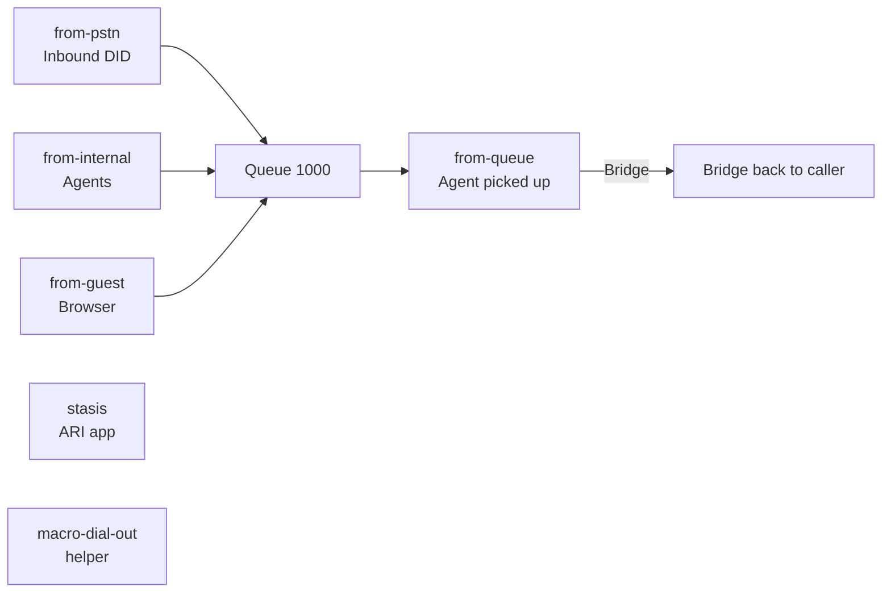
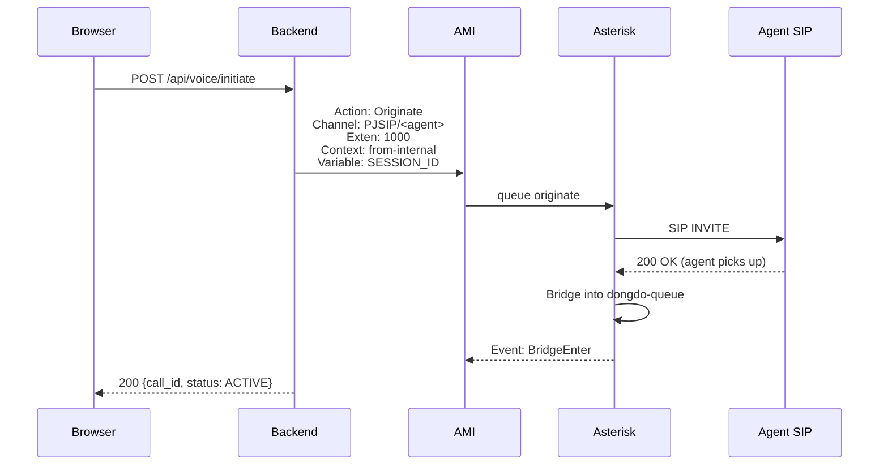

# 📞 Telephony — Tích hợp Asterisk 20 (PJSIP + AMI)

> **Phiên bản:** v2.0
> **Đối tượng:** Backend devs, DevOps, VoIP engineers
> **Cập nhật lần cuối:** Sep 2026

## Mục lục

1. [AMI vs ARI — khi nào dùng cái nào](#1-ami-vs-ari--khi-nào-dùng-cái-nào)
2. [Kiến trúc Asterisk container](#2-kiến-trúc-asterisk-container)
3. [PJSIP endpoints](#3-pjsip-endpoints)
4. [Dialplan](#4-dialplan)
5. [Queue configuration](#5-queue-configuration)
6. [AMI events backend lắng nghe](#6-ami-events-backend-lắng-nghe)
7. [Originate call flow](#7-originate-call-flow)
8. [Transfer / Hold / Mute](#8-transfer--hold--mute)
9. [Recording (MixMonitor)](#9-recording-mixmonitor)
10. [CDR (Call Detail Records)](#10-cdr-call-detail-records)
11. [Troubleshooting](#11-troubleshooting)
12. [Cross-references](#12-cross-references)

---

## 1. AMI vs ARI — khi nào dùng cái nào

| | **AMI** (Asterisk Manager Interface) | **ARI** (Asterisk REST Interface) |
|---|---|---|
| **Protocol** | TCP line-based text, port 5038 | HTTP + WebSocket, port 8088 |
| **Mô hình** | Action/Event (fire-and-forget hoặc subscribe) | Stateful stasis app, full call control |
| **Phù hợp** | Originate, transfer, status queries, queue mgmt | IVR phức tạp, WebRTC bridging, custom call flows |
| **Dùng cho v2.0** | ✅ Điều khiển cuộc gọi (originate, hangup, status) | Chuẩn bị cho future stasis app `dongdo-ivr` |
| **Auth** | `manager.conf` user/pass | `ari.conf` user/pass |

### 1.1 Khi nào dùng AMI

- Gọi outbound: `Action: Originate`
- Hanging up: `Action: Hangup`
- Subscribe events: `Action: Events`
- Truy vấn trạng thái: `Action: Status`, `Action: QueueStatus`
- Redirect / transfer: `Action: Redirect`

### 1.2 Khi nào dùng ARI

- WebRTC browser-to-Asterisk (thay vì dùng SIP.js trực tiếp)
- IVR phức tạp với stasis dialplan app
- Custom recording / playback control
- Real-time channel manipulation

> **Quyết định v2.0:** Dùng AMI cho mọi call control vì đơn giản và ổn định. WebRTC fallback ở browser dùng JsSIP / SIP.js nếu cần thiết (xem [ARCHITECTURE §3](./ARCHITECTURE.md#3-frontend-nextjs)).

---

## 2. Kiến trúc Asterisk container

```text
docker/asterisk/
├── Dockerfile                      # Multi-stage: builder + runtime (slim)
├── entrypoint.sh                   # Wait-for services + template secrets
└── etc/asterisk/
    ├── asterisk.conf               # Main config
    ├── pjsip.conf                  # SIP endpoints (500+ lines)
    ├── extensions.conf             # Dialplan (5 contexts)
    ├── queues.conf                 # Queue definitions
    ├── manager.conf                # AMI users
    ├── ari.conf                    # ARI users
    ├── http.conf                   # Built-in HTTP server
    ├── rtp.conf                    # RTP port range
    ├── modules.conf                # Module loading
    ├── logger.conf                 # Log levels
    ├── cdr.conf / cdr_csv.conf     # CDR configuration
    ├── cel.conf / cel_custom.conf  # Channel Event Logging
    ├── features.conf               # One-touch recording features
    ├── musiconhold.conf            # MOH classes
    ├── voicemail.conf              # Voicemail boxes
    └── dnsmgr.conf / indications.conf / ...
```

### 2.1 Dockerfile highlights

```dockerfile
FROM asterisk:20-current-bookworm AS builder
RUN apt-get install -y opus-tools unixodbc srtp-utils sox ffmpeg

FROM asterisk:20-current-bookworm AS runtime
EXPOSE 5060/udp 5061/tcp 5038/tcp 8088/tcp 10000-20000/udp
HEALTHCHECK --interval=15s --timeout=5s --retries=5 \
    CMD asterisk -rx "pjsip show endpoints" | grep -q "Endpoint:" || ...
ENTRYPOINT ["/usr/bin/tini", "--", "/usr/local/bin/entrypoint.sh"]
```

### 2.2 Entrypoint

`entrypoint.sh` thực hiện:

1. Fix ownership cho `/var/spool/asterisk`, `/var/log/asterisk`, ...
2. **Wait-for Postgres + Redis** (skip nếu `NO_WAIT=1`)
3. **Template secrets** từ env → file config (AMI pass, ARI pass, SIP password):
   ```bash
   sed -i "s|\${ASTERISK_AMI_PASS}|${ASTERISK_AMI_PASS}|g" /etc/asterisk/manager.conf
   ```
4. Validate dialplan với `asterisk -rx "dialplan show from-internal"`
5. `exec asterisk -f -vvv` (foreground)

---

## 3. PJSIP endpoints

### 3.1 Template

Mọi endpoint kế thừa `[template-dongdo]`:

```ini
[template-dongdo](!)
type=endpoint
context=from-internal
allow=!all,opus,alaw,ulaw,g729
disallow=all
codec_prefs=opus,alaw,ulaw,g729
use_avpf=yes            ; WebRTC-friendly
media_use_received_transport=yes
ice_support=yes         ; ICE cho browser SIP
turn_port=3478
rtp_symmetric=yes       ; NAT traversal
rtp_keepalive=5
force_rport=yes
rewrite_contact=yes
one_touch_recording=yes ; MixMonitor bằng phím *
record_on_feature=automixmon
```

### 3.2 Transports

| Transport | Port | Protocol | Use |
|---|---|---|---|
| `transport-udp` | 5060/udp | UDP SIP | Agent hardphones, softphones |
| `transport-tls` | 5061/tcp | TLS SIPS | Production SIP trunk (secure) |

### 3.3 Endpoints

| Type | Pattern | Auth | Count |
|---|---|---|---|
| **Agent** | `agent-1001`...`agent-1010` | `username=1001`, `password=<prefix>1001` | 5-10 |
| **Guest** | `guest` (dynamic) | `username=guest`, `password=<env>` | max 10 contacts |
| **Trunk PSTN** | `trunk-pstn` | ITSP credentials | 1 |
| **ARI** | `ari-user` | — | 1 |

### 3.4 Agent registration

Mỗi agent SIP client (hardphone / softphone):

```
SIP Server:  <host>
Username:    1001
Password:    dongdoagent1001
Realm:       dongdo.local
Transport:   UDP (hoặc TLS nếu production)
```

Trong dev, default password = `dongdoagent<exten>`.

### 3.5 Codec preferences

Thứ tự ưu tiên: **Opus → G.711a → G.711u → G.729**

> 💡 Opus là codec chính cho WebRTC clients. G.711 (PCMA/PCMU) cho PSTN compatibility. G.729 cần license (đã disallow nếu không có license).

---

## 4. Dialplan

### 4.1 Context map



### 4.2 Routing rules

#### `from-pstn` — inbound DID

```ini
exten => 1000,1,Answer()
 same => n,Queue(dongdo-queue,tT,,,120)
```

- `tT` cho phép transfer + recording
- Timeout 120s vào voicemail

#### `from-internal` — agents dial

```ini
exten => *97,1,VoiceMailMain(${CALLERID(num)}@default)
exten => *98,1,VoiceMailMain(${CALLERID(num)}@default)
exten => *1,1,MixMonitor(${MONITOR_FILENAME},a)  ; one-touch recording
exten => _10XX,1,Dial(PJSIP/${EXTEN},60,tT)
exten => _8X.,1,Dial(PJSIP/${EXTEN:1}@trunk-pstn,60,tT)  ; outbound PSTN
```

#### `from-guest` — browser SIP (giới hạn)

```ini
exten => 1000,1,Queue(dongdo-queue,tT,,,60)
exten => _10XX,1,Dial(PJSIP/${EXTEN},30,tT)
exten => _8X.,1,Playback(privacy-incorrect)  ; block direct PSTN
```

> ⚠️ Guest context **không được dial trực tiếp ra PSTN** — phải qua queue hoặc agent.

### 4.3 Helper macro

```ini
[macro-dial-out]
exten => s,1,Dial(PJSIP/${NUMBER}@${TRUNK},${TIMEOUT},tT)
exten => s,n,Return(${DIALSTATUS})
```

Dùng: `Gosub(macro-dial-out,s,1(trunk-pstn,84987654321,60))`

---

## 5. Queue configuration

`queues.conf` định nghĩa 3 queue:

| Queue | Strategy | Members | Use |
|---|---|---|---|
| `dongdo-queue` | `ringall` | PJSIP/1001..1005 | Main CSKH inbound |
| `dongdo-supervisor` | `leastrecent` | (dynamic) | Escalation |
| `dongdo-sales` | `roundrobin` | (dynamic) | Outbound campaigns |

### 5.1 Key options

```ini
[dongdo-queue]
strategy=ringall              ; ring all members simultaneously
timeout=20                    ; ring each member 20s
retry=5                       ; retry 5 times before next member
wrapuptime=10                 ; post-call wrap-up (10s)
announce-holdtime=yes         ; tell caller estimated wait
announce-frequency=30         ; re-announce every 30s
servicelevel=30               ; SL target (answer within 30s)
monitor_format=wav
monitor_type=MixMonitor
joinempty=yes
leavewhenempty=no
member => PJSIP/1001,hint:1001@from-internal,0
```

### 5.2 Add member qua AMI

```bash
Action: QueueAdd
Queue: dongdo-queue
Interface: PJSIP/1006
MemberName: Agent 1006
```

---

## 6. AMI events backend lắng nghe

Go backend subscribe các event sau qua AMI:

| Event | Khi nào | Backend xử lý |
|---|---|---|
| `Dial` | Channel dial begin/end | Update `voice_calls.status` |
| `DialBegin` | Dial bắt đầu | Log |
| `BridgeEnter` | Channel join bridge | Set status=ACTIVE, broadcast WS |
| `BridgeLeave` | Channel leave bridge | Log |
| `Hangup` | Channel hangup | Set status=ENDED, stop MixMonitor |
| `Newchannel` | New channel tạo | Log |
| `Newstate` | Channel state change | Track RINGING → UP |
| `Hold` / `Unhold` | Music on hold toggle | Broadcast WS |
| `QueueMemberAdded` / `QueueMemberRemoved` | Member join/leave queue | Update admin UI |
| `Cdr` | Call completed | Save to DB (if CDR backend = DB) |
| `CEL` | Channel Event Log | Optional detailed audit |

### 6.1 Subscribe events

```bash
Action: Events
EventMask: call,dial,bridge,hold,queue,cdr
```

(Trong backend, dùng `Action: Events` ngay sau `Action: Login`.)

---

## 7. Originate call flow

### 7.1 Backend → Asterisk

```go
// Pseudo-code (Go backend -> AMI client)
err := amiClient.Originate(&ami.OriginateParams{
    Channel:   "PJSIP/1001",       // agent extension
    Exten:     "1000",             // queue extension to bridge to
    Context:   "from-internal",
    Priority:  1,
    CallerID:  "Guest <guest>",
    Variable:  map[string]string{
        "DONGDO_SESSION_ID": sessionID,
        "DONGDO_CALL_ID":    strconv.FormatInt(callID, 10),
    },
    Async:     true,               // don't block waiting
})
```

### 7.2 AMI wire format

```text
Action: Originate
Channel: PJSIP/1001
Exten: 1000
Context: from-internal
Priority: 1
CallerID: Guest <guest>
Variable: DONGDO_SESSION_ID=session-abc
Variable: DONGDO_CALL_ID=42
Async: yes

Response: Success
Message: Originate successfully queued
```

### 7.3 Browser-initiated (guest → CSKH)



### 7.4 Inbound (PSTN → agent)

```text
PSTN trunk → context=from-pstn → exten=1000 → Queue(dongdo-queue)
                                                         │
                                                         ▼
                                          agents ring (PJSIP/1001..1005)
                                                         │
                                                         ▼ (first pickup)
                                          Bridge caller ↔ agent
```

---

## 8. Transfer / Hold / Mute

### 8.1 Transfer (attended)

```bash
# Trong dialplan: atxfer or blind transfer via feature codes
exten => *2,1,AttendedTransfer(PJSIP/1002)  ; attended
exten => *3,1,BlindTransfer(PJSIP/1002)     ; blind
```

Hoặc qua AMI:

```bash
Action: Atxfer
Channel: <channel-id>
Exten: 1002
Context: from-internal
```

### 8.2 Hold (Music on hold)

```bash
Action: Hold
Channel: <channel-id>
```

Asterisk chuyển channel sang `MusicOnHold(default)` class. Backend nhận event `Hold`, broadcast WS `type=call_status{payload:{hold:true}}`.

### 8.3 Mute

Asterisk không có "mute" thuần túy — dùng `moh_suggest` hoặc `Action: MuteAudio`:

```bash
Action: MuteAudio
Channel: <channel-id>
Direction: both      ; in / out / both
```

---

## 9. Recording (MixMonitor)

### 9.1 Auto-record khi vào queue

`queues.conf`:

```ini
[dongdo-queue]
monitor_type=MixMonitor
monitor_format=wav
```

→ Khi agent pickup queue call, tự động start MixMonitor.

### 9.2 One-touch recording (`*1`)

`extensions.conf`:

```ini
exten => *1,1,Set(MONITOR_FILENAME=/var/spool/asterisk/monitor/${UNIQUEID}-${CALLERID(num)}-${STRFTIME(${EPOCH},,%Y%m%d-%H%M%S)}.wav)
 same => n,MixMonitor(${MONITOR_FILENAME},a)
```

Agent bấm `*1` mid-call → file WAV sinh ra.

### 9.3 PJSIP template

```ini
[template-dongdo](!)
one_touch_recording=yes
record_on_feature=automixmon
```

→ Cho phép record qua DTMF feature.

### 9.4 Recording path

```
/var/spool/asterisk/monitor/
  └── 1716438234.123-84912345678-20240904-153045.wav
```

Mounted vào host: `./recordings/` (docker-compose).

### 9.5 Backend ingest recording

```bash
POST /api/voice/upload-recording
  multipart/form-data:
    audio: <file>
    session_id: session-abc
    call_id: 42
    duration_seconds: 123
    transcript: "..." (optional, from STT)
```

Backend:

1. Lưu file vào `./recordings/`
2. Update `voice_calls.recording_url`, `duration_seconds`, `status=ENDED`
3. Nếu có transcript → lưu vào `voice_calls.transcript`
4. Tạo Learning queue item tự động (nếu auto-learning enabled)

### 9.6 Convert WAV → MP3 (optional)

Dùng ffmpeg:

```bash
ffmpeg -i in.wav -codec:a libmp3lame -qscale:a 2 out.mp3
```

---

## 10. CDR (Call Detail Records)

### 10.1 CDR backend: CSV (default) hoặc Postgres (ODBC)

`cdr.conf`:

```ini
[general]
enable=yes

[csv]
usegmtime=no
loguniqueid=yes
loguserfield=yes
accountlogs=yes
```

→ File `/var/log/asterisk/cdr-csv/master.csv` chứa:

```
"src","dst","context","channel","dstchannel","lastapp","lastdata","start","answer","end","duration","billsec","disposition","amaflags","uniqueid","userfield"
"84912345678","1000","from-pstn","PJSIP/trunk-1","PJSIP/1001-00001","Queue","dongdo-queue,tT,,,120","2024-09-04 15:30:45","2024-09-04 15:30:50","2024-09-04 15:35:12","267","262","ANSWERED",,"1716438245.123","session-abc"
```

### 10.2 Push CDR vào Postgres (optional)

`cdr_adaptive_odbc.conf` + `res_odbc.conf` cấu hình ODBC connection tới Postgres.

Hoặc dùng Cel (Channel Event Logging) `cel_custom.conf` để ghi JSON events vào file, rồi backend tail file.

### 10.3 Backend ingest CDR

Backend đọc `master.csv` qua `csvtail` (systemd) hoặc subscribe AMI `Event: Cdr`. Trong v2.0, mỗi call được track qua `voice_calls` table — CDR chỉ dùng để audit/post-analysis.

---

## 11. Troubleshooting

### 11.1 AMI authentication fails

**Triệu chứng:** Backend log `AMI login failed: Authentication failed`.

**Nguyên nhân & sửa:**

1. Sai password — check env `ASTERISK_AMI_PASS` khớp với `manager.conf` (sau template)
2. Container chưa template secrets — restart asterisk container:
   ```bash
   docker compose restart asterisk
   ```
3. Network — từ container `server`, kiểm tra:
   ```bash
   docker compose exec server nc -zv asterisk 5038
   ```
4. ACL trong `manager.conf`:
   ```ini
   permit=0.0.0.0/0.0.0.0
   deny=0.0.0.0/0.0.0.0
   ```
   Trong dev giữ `permit=0.0.0.0/0`; production giới hạn `permit=172.16.0.0/12` (docker network).

### 11.2 Calls không bridge

**Triệu chứng:** `voice_calls.status` stuck ở `RINGING`, không bao giờ `ACTIVE`.

**Check list:**

1. **Agent SIP không register:**
   ```bash
   docker compose exec asterisk asterisk -rx "pjsip show endpoints"
   ```
   Phải thấy `Endpoint: 1001/1001  Avail  1001(192.168.x.x)  A  A`
2. **Codec mismatch:** Opus vs alaw — check `allow=` ở endpoint
3. **RTP port blocked:** Mở firewall `10000-20000/udp`
4. **Queue empty:**
   ```bash
   asterisk -rx "queue show dongdo-queue"
   ```
   Phải có ≥1 member

### 11.3 One-way audio

**Triệu chứng:** Một bên nghe, bên kia không.

**Nguyên nhân thường gặp:**

1. **NAT traversal** — set `nat=force_rport,comedia` hoặc `rtp_symmetric=yes`
2. **RTP ports bị firewall block** — UDP 10000-20000
3. **Media IP sai** — set `external_media_address` và `external_signaling_address` trong PJSIP global nếu NAT
4. **STUN/TURN chưa config** cho browser clients

### 11.4 No audio / SIP register fails

**Triệu chứng:** SIP client không register được.

**Check:**

```bash
docker compose logs asterisk | grep -i "register\|401\|403"
```

**Nguyên nhân:**

1. **SIP port 5060 blocked** — check `nc -uvz <host> 5060`
2. **Auth credentials sai** — `username`/`password` không khớp với PJSIP config
3. **Realm sai** — `realm=dongdo.local`, phải match với SIP client
4. **TLS cert** — nếu dùng `transport-tls`, cert tại `/etc/asterisk/keys/asterisk.pem` phải valid

### 11.5 AMI disconnects liên tục

**Triệu chứng:** Backend log `AMI disconnected`, reconnect loop.

**Fix:**

1. **Increase `readtimeout`** trong AMI client (Go: `goami.AMI{ReadTimeout: 30 * time.Second}`)
2. **Keepalive**: gửi `Action: Ping` mỗi 30s
3. **Network stability** — check MTU, packet loss
4. **TLS** — dùng AMI over TLS (`port=5039`) cho production

### 11.6 Recording files rỗng

**Triệu chứng:** File WAV sinh ra nhưng 0 bytes.

**Nguyên nhân:**

1. **Codec mismatch** — Asterisk không transcode được
2. **MixMonitor format sai** — thử `monitor_format=wav` thay vì `wav49`
3. **Permissions** — check ownership `/var/spool/asterisk/monitor/` (asterisk:asterisk)

### 11.7 Dialplan không match extension

**Triệu chứng:** Gọi 1000 → "Extension not found".

**Fix:**

```bash
docker compose exec asterisk asterisk -rx "dialplan show from-internal"
```

Verify extension `1000` tồn tại trong context đúng. Reload:

```bash
asterisk -rx "dialplan reload"
```

---

## 12. Cross-references

- [ARCHITECTURE.md §5 Telephony](./ARCHITECTURE.md#5-telephony-asterisk-20) — high-level
- [DEPLOYMENT.md](./DEPLOYMENT.md) — production deployment (SSL, firewall)
- [CONFIGURATION.md §2](./CONFIGURATION.md#2-asterisk-configuration) — Asterisk env vars
- [TROUBLESHOOTING.md](./TROUBLESHOOTING.md) — common issues
